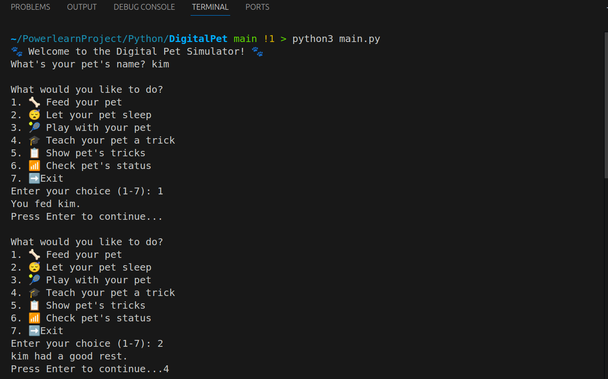
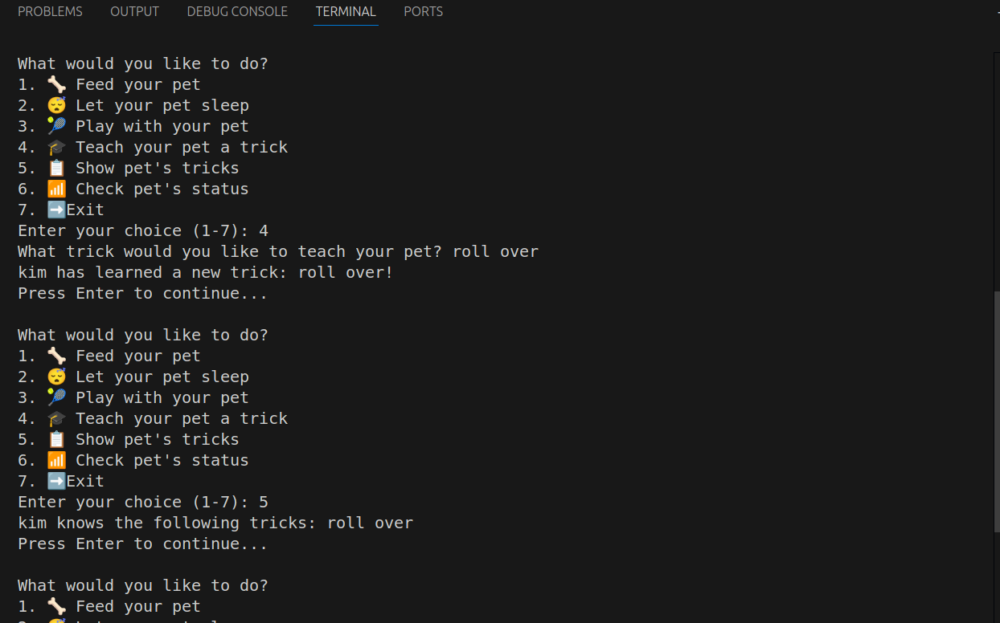
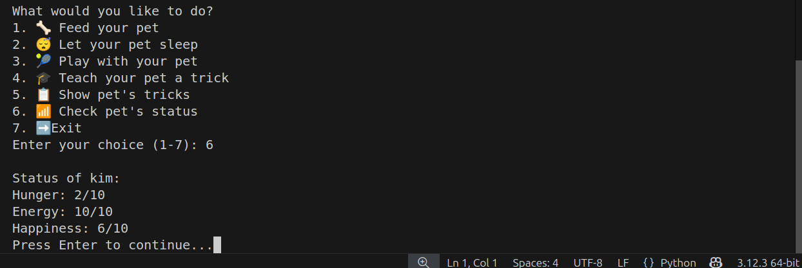

# 🐶 Digital Pet Simulator

Welcome to the **Digital Pet Simulator**, a fun and interactive Python project that allows users to care for a virtual pet using Object-Oriented Programming (OOP) principles. Users can feed, play with, train, and monitor the status of their digital pet!

---

## 📌 Features

- 🦴 Feed your pet and make it happy
- 😴 Let your pet rest to regain energy
- 🎾 Play with your pet to boost happiness
- 🎓 Train your pet to learn new tricks
- 📶 View pet status (hunger, energy, happiness)
- 📚 Show off learned tricks

---

## 🧠 Concepts Covered

- Python Classes & Objects
- Attributes and Methods
- Constructor (`__init__`)
- Lists for storing tricks
- Conditional Logic and Loops
- User Input and Interaction

---

## 📁 Project Structure

DigitalPet/ │ ├── pet.py # Contains the Pet class and all pet behaviors ├── main.py # User interaction logic and interface └── README.md

---

## ▶️ Getting Started

1. Clone or download this repository.
2. Make sure you have Python installed (version 3.x).
3. Run the simulator:

---

## 🖼️ Example Output

---

## ✨ Author

**Elsy Kimaka, BSc**  
Built as part of the **PLP Python OOP Challenge**.

